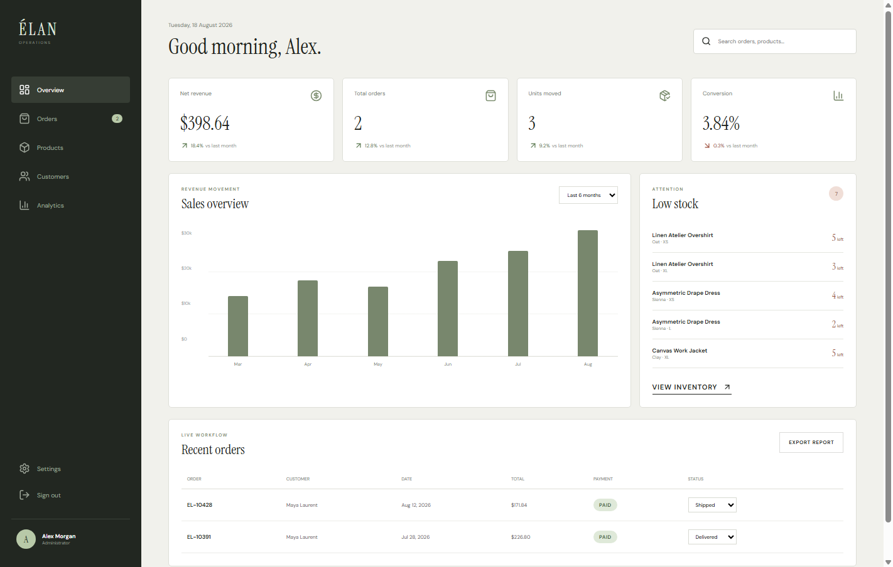

# Élan Atelier

Élan Atelier is a modern full-stack clothing commerce experience built from the supplied project guide. It combines an editorial, responsive React storefront with a secure Express API, product variants and inventory rules, persistent cart and wishlist state, checkout, customer order tracking, and a role-protected admin operations dashboard.

The repository runs immediately in seeded demo mode, so the complete portfolio flow can be explored without configuring a database. Mongoose schemas and environment configuration are included for connecting MongoDB as the persistence layer.


## Highlights

### Customer experience

- Editorial landing page with original AI-generated campaign artwork
- Searchable, filterable and sortable product catalog
- Product details with sizes, colors, stock indicators and care notes
- Versioned local cart and wishlist persistence
- Shopper registration/login with JWT sessions and bcrypt password hashes
- Stock-validated mock checkout with server-side price recalculation
- Order confirmation, history and visual tracking timeline
- Loading, error, empty and responsive UI states

### Admin experience

- Role-protected operations dashboard
- Revenue, orders, units and conversion metrics
- Six-month revenue visualization
- Low-stock variant alerts by SKU
- Order table with live status transitions
- Customer/admin authorization enforced by the API



### Responsive storefront


## Demo credentials

The sign-in screen includes buttons that populate either account automatically.

| Role | Email | Password |
| --- | --- | --- |
| Shopper | `shopper@elan.demo` | `ShopElan2026!` |
| Admin | `admin@elan.demo` | `AdminElan2026!` |

No real payment is processed. The checkout card is a labeled portfolio sandbox.

## Technology

- React 19, TypeScript, Vite and React Router
- Express 5 REST API
- Mongoose domain schemas for users, products/variants and orders
- JWT authentication and bcrypt password hashing
- Zod request validation
- Helmet, CORS restrictions and authentication rate limiting
- Node test runner and Supertest
- CSS design system with accessible responsive states

## Architecture

```text
ecommerce-clothing-store/
├── client/
│   ├── public/images/          # Original campaign artwork
│   └── src/
│       ├── api/                # Typed API client
│       ├── components/         # Layout, navigation, cart and product UI
│       ├── context/            # Cart, wishlist, session and catalog state
│       ├── pages/              # Storefront, checkout, account and admin screens
│       ├── App.tsx             # Route definitions
│       └── styles.css          # Responsive design system
├── server/
│   ├── src/
│   │   ├── config/             # Environment configuration
│   │   ├── data/               # Seeded zero-config demo store
│   │   ├── middleware/         # Auth, roles, validation and error handling
│   │   ├── models/             # Production-oriented Mongoose schemas
│   │   ├── routes/             # REST resources
│   │   ├── services/           # Inventory and order business rules
│   │   └── validation/         # Zod request contracts
│   └── test/                   # API and authorization tests
└── screenshots/                # Chrome-verified portfolio captures
```

## Run locally

Requirements: Node.js 20 or newer.

```bash
npm install
npm run dev
```

Open `http://localhost:5173`. The API runs at `http://localhost:5000`, and its health endpoint is `http://localhost:5000/api/health`.

### Environment variables

Copy `.env.example` to `.env` when you want to override defaults:

```env
PORT=5000
MONGODB_URI=
JWT_SECRET=replace-with-a-long-random-secret
CLIENT_URL=http://localhost:5173
VITE_API_URL=http://localhost:5000/api
```

When `MONGODB_URI` is empty, the server uses the seeded in-memory demo store. Never commit a populated `.env` file.

## Scripts

```bash
npm run dev       # Start the Express API and Vite client together
npm run build     # Type-check and create the production client bundle
npm run test      # Run API, business-rule and authorization tests
npm run check     # Run tests followed by the production build
```

## API summary

| Method | Endpoint | Access | Purpose |
| --- | --- | --- | --- |
| `GET` | `/api/health` | Public | Service health and persistence mode |
| `POST` | `/api/auth/register` | Public | Create a customer account |
| `POST` | `/api/auth/login` | Public | Return a signed JWT session |
| `GET` | `/api/products` | Public | Catalog search, filter, sort and pagination |
| `GET` | `/api/products/:slug` | Public | Product variants, stock and reviews |
| `GET/POST/PUT/DELETE` | `/api/cart` | Customer | Manage server-side cart resources |
| `GET/POST` | `/api/wishlist` | Customer | Read or toggle saved products |
| `POST` | `/api/orders` | Customer | Validate stock, snapshot prices and create an order |
| `GET` | `/api/orders/my` | Customer | Read the authenticated customer’s orders |
| `GET` | `/api/admin/dashboard` | Admin | Metrics, inventory alerts and order workflow |
| `PUT` | `/api/admin/orders/:id/status` | Admin | Apply an authorized order-status transition |

Every response uses a consistent `{ success, message, data, errors }` shape. Backend authorization is enforced independently from the React interface.

## Verification

- 5 API tests pass: health, catalog filtering, anonymous rejection, customer checkout and admin authorization.
- The production TypeScript/Vite build succeeds with 1,699 modules transformed.
- Google Chrome automated smoke checks cover home rendering, quick-add/cart, catalog, product details, admin login and dashboard rendering.
- Chrome reported no runtime exceptions, console errors or Vite error overlay.
- Desktop (1440×1000) and mobile (390×844) layouts were visually inspected.

## Current limitations and production next steps

- Seeded demo data resets when the API process restarts. Connect the included Mongoose models to repositories/services for durable production persistence.
- Product photography other than the original hero uses curated remote image URLs; production should move these to managed image storage and optimization.
- Payment is intentionally mocked. A production release should use a hosted payment flow and verified webhooks.
- Email receipts, coupons, returns/refunds and product recommendations remain good extension points from the guide.

## Design note

The original hero artwork was generated specifically for this project with OpenAI’s built-in image generation workflow. The interface, brand direction and implementation are original to this repository.
